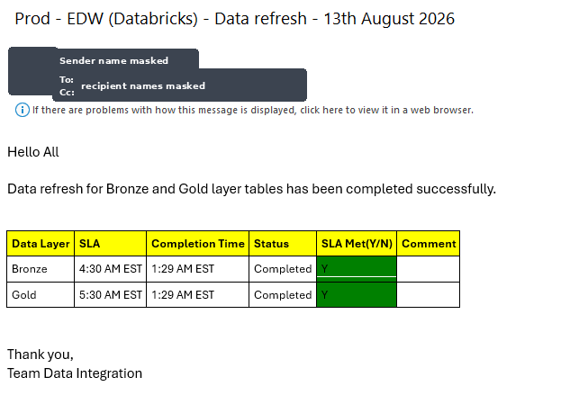

# Databricks Job Monitoring

Monitors a set of dependent Databricks workflows, checks whether each
data layer (Bronze, Gold, ...) completed its daily refresh within
SLA, and emails a status report to stakeholders — a failure email as
soon as any dependency fails, and a success email once every
dependency for a layer has completed.

## What it does

1. Creates two Unity Catalog audit tables if they don't already exist
   (`workflow_run_log`, `notification_log`).
2. Calls the Databricks Jobs REST API to pull recent job run history.
3. Flattens the API response and keeps each job's latest run for today.
4. Compares those runs against a declared dependency list (which
   workflows each data layer needs) to compute per-layer status and
   SLA compliance.
5. Sends an HTML failure email if anything failed and hasn't already
   been notified about today.
6. Sends an HTML success email once every dependency in a layer has
   completed, and hasn't already been notified about today.
7. Logs every run and every notification to Unity Catalog tables for
   history/audit.

## Sample notification

Once a data layer's dependencies have all completed successfully,
`job_monitoring_main.py` sends an HTML success email similar to the
one below. Sender and recipient identities have been redacted from
this sample screenshot.



## Prerequisites

Before you start, make sure you have:

- **A Databricks workspace** (AWS, Azure, or GCP) with Unity Catalog
  enabled — the audit tables are written to Unity Catalog
  (`workspace.silver.*` by default).
- **A cluster or SQL warehouse** running a standard Databricks Runtime
  (pyspark, pandas, and requests come preinstalled; the only extra
  package needed is `arrow` — see `requirements.txt`).
- **Permissions** to:
  - Create/write Unity Catalog tables in the target catalog/schema.
  - Create a Databricks Secret Scope (or workspace admin access to
    have one created for you).
  - Create/edit Databricks Jobs (to schedule the notebook).
- **A Databricks Personal Access Token (PAT)** with permission to call
  the Jobs API (`/api/2.0/jobs/*`, `/api/2.1/jobs/*`) for the runs you
  want to monitor.
- **An SMTP-capable email account** (e.g. Office 365/Outlook) with an
  app password or account password you can store as a secret, to send
  the notification emails.
- **The `databricks` CLI** installed locally (or workspace UI access)
  to create the secret scope and secrets — see Setup step 2.

## Repository contents

| File | Purpose |
|---|---|
| `config.py` | All environment settings: workspace URL, SMTP settings, recipient lists, SLA thresholds, table names. Reads secrets from Databricks Secret Scopes or environment variables — **no credentials are hardcoded**. |
| `databricks_api_client.py` | `DatabricksAPI` class: thin wrapper around the Databricks Jobs REST API (get job details, trigger a run, list runs). |
| `workflow_dependencies.py` | The declarative list of which workflows each data layer/subject area depends on. **Edit this file to onboard a new workflow.** |
| `job_run_processor.py` | Flattens the raw, nested Jobs API run objects into a typed Spark DataFrame. |
| `email_utils.py` | Builds the color-coded HTML status table and sends the notification email over SMTP. |
| `file_utils.py` | Small helpers: safe nested-dict lookup (`json_parse`), recursive DBFS/Volumes directory listing, folder cleanup. |
| `job_monitoring_main.py` | The main Databricks notebook that wires everything above together. Import this into a Databricks Workflow/Job as the entry point. |
| `requirements.txt` | The one extra pip package (`arrow`) this project needs beyond what's preinstalled on a Databricks cluster. |
| `README.md` | This file. |

## Setup & Run Order

Follow these steps in order — each one depends on the previous.

### 1. Upload the files to your Databricks workspace

Import `job_monitoring_main.py` and the other `.py` files into the
same workspace folder (e.g. via Repos, or the Workspace file
browser). Because `job_monitoring_main.py` keeps the
`# Databricks notebook source` header and `# COMMAND ----------` cell
markers, Databricks will recognize it as a runnable notebook, and it
can `import` the sibling modules directly since they live in the same
folder (Databricks adds the notebook's folder to `sys.path`
automatically for files-in-repo/workspace imports).

### 2. Configure secrets (do this before running anything)

Never put the Databricks token or the SMTP password directly in these
files. Instead:

```bash
# One-time: create a secret scope
databricks secrets create-scope job-monitoring

# Add your Databricks Jobs API token
databricks secrets put-secret job-monitoring databricks-pat

# Add your SMTP account password / app password
databricks secrets put-secret job-monitoring smtp-password
```

`config.py` automatically reads both secrets from this scope at
runtime. If you're testing outside Databricks (no `dbutils`
available), it falls back to the `DATABRICKS_ADMIN_PAT` and
`SMTP_PASSWORD` environment variables instead.

### 3. Set the rest of the configuration

Either edit the defaults in `config.py`, or (recommended) set these
as environment variables / job parameters on the Databricks Job that
runs this notebook:

| Variable | Purpose | Example |
|---|---|---|
| `DBW_WS_BASE_URL` | Your Databricks workspace URL | `https://dbc-xxxxxxxx.cloud.databricks.com` |
| `SMTP_SERVER` | SMTP host | `smtp.office365.com` |
| `SMTP_PORT` | SMTP port | `587` |
| `SENDER_EMAIL` | "From" address / SMTP login | `data-alerts@yourcompany.com` |
| `TO_FAILED_EMAIL_LIST` | Semicolon-separated recipients for failure emails | `a@company.com;b@company.com` |
| `TO_SUCCESS_EMAIL_LIST` | Semicolon-separated recipients for success emails | `a@company.com;b@company.com` |
| `DAYS_BACK_IN_HISTORY` | How many days of run history to pull each execution | `1` |
| `WORKFLOW_RUN_LOG_TABLE` | Unity Catalog table for the run audit log | `workspace.silver.workflow_run_log` |
| `NOTIFICATION_LOG_TABLE` | Unity Catalog table for the notification log | `workspace.silver.notification_log` |

### 4. Declare your workflow dependencies

Edit `workflow_dependencies.py` and add one entry per
`(SubjectArea, WorkflowName, DependsOn, layer)` combination you want
monitored. No other file needs to change to onboard a new workflow.

### 5. Install the extra Python dependency

If your cluster doesn't already have `arrow` installed, either:
- Add `arrow` as a cluster library, or
- Run `%pip install -r requirements.txt` as the first cell.

### 6. Do a manual test run

Attach `job_monitoring_main.py` to a cluster and run it once
interactively (Run All). Confirm:
- The two Unity Catalog tables get created without error.
- The job-run pull from the Jobs API returns data.
- A test email arrives (temporarily point `TO_FAILED_EMAIL_LIST` /
  `TO_SUCCESS_EMAIL_LIST` at your own address for this test).

### 7. Schedule it

Once the manual run looks correct, create a Databricks Job pointing
at `job_monitoring_main.py`, scheduled to run on whatever cadence
matches your data refresh cycle (e.g. every 30 minutes during your
ingestion window).

## Security notes

- The original version of this project had a live Databricks Personal
  Access Token and a plaintext email password hardcoded in the source.
  Both have been removed. **If those original credentials were ever
  exposed (git history, shared exports, etc.), rotate/revoke them.**
- Always use Databricks Secret Scopes for credentials when running in
  Databricks — never commit tokens or passwords to notebooks or `.py`
  files.

## Testing outside Databricks

`config.py`, `databricks_api_client.py`, `email_utils.py`,
`file_utils.py`, `job_run_processor.py`, and `workflow_dependencies.py`
are plain Python modules (Spark/`dbutils` objects are passed in as
parameters rather than assumed to be global), so most of the logic can
be unit tested locally with `pytest` and a mocked `SparkSession` /
`dbutils`. Only `job_monitoring_main.py` requires an actual Databricks
notebook runtime, since it relies on the notebook-global `spark` and
`dbutils` objects and `%sql` magic commands.

## License / Disclaimer

This project is provided **as-is, with no warranty of any kind**,
express or implied, including but not limited to warranties of
merchantability, fitness for a particular purpose, or
non-infringement. Use it at your own risk.

- No license is granted to any third-party trademarks referenced here
  (Databricks®, Office 365®, etc.); they remain the property of their
  respective owners.
- You are responsible for reviewing, testing, and securing this code
  (including credential handling, recipient lists, and table names)
  before running it against any production workspace or data.
- This code sends email and writes to Unity Catalog tables — validate
  it in a non-production environment first.
- If you intend to distribute or open-source this repository, add a
  formal license file (e.g. MIT, Apache-2.0) matching your
  organization's policy; none is bundled by default.
